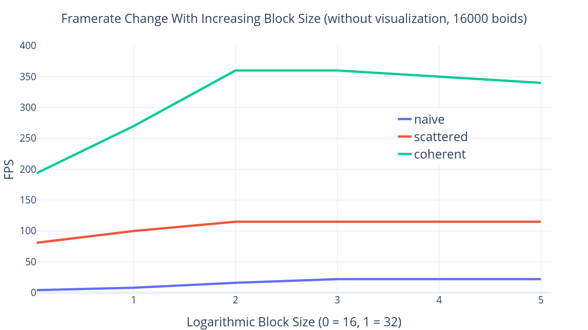

Project 1 Flocking
====================

**University of Pennsylvania, CIS 565: GPU Programming and Architecture, Project 1**

* Jiangping Xu
  * [LinkedIn](https://www.linkedin.com/in/jiangping-xu-365b19134/)
* Tested on: Windows 10, i7-4700MQ @ 2.40GHz 8GB, GT 755M 6100MB (personal laptop)
_________________________________________________________________________
[Introduction](#artificial-life) - [Performance Analysis](#performance-analysis) - [Questions](#questions)
_________________________________________________________________________
## Introduction
This is a project of the course CIS 565: GPU programming and Architecture. A flocking simulation based on the Reynolds Boids algorithm is implemented, along with two levels of optimization: a uniform grid, and a uniform grid with semi-coherent memory access.

## Performance Analysis

When number of boids is less than 1300, the naive method is better than the improved methods. This may caused by the cost of sorting the grid index and not enough culling out boids.

Visualization limits fps as shown in the figure above. As the number of boids increases, the result converges to that of no visualization, because the computation of boid positions gradually becomes the bottleneck.

A block size that isn't too small (< 64) is the optimal choice.

Visualization will reduce frame rate as the same.

## Questions
<b>For each implementation, how does changing the number of boids affect performance? Why do you think this is?</b>

Generally speaking, more boids means more computation and more time to calulate a frame. The naive method is relatively more sensitive to the number of boids than the other two methods. The frame rate of naive method drops sharply as the number of boids increases. The uniform grid method culls out most of the boid pairs to check and the number of boids in a neighboring space is almost constant, so the time complexity of this algorithm is close to O(N). (which means fps ~ 1/N, when N big enough). The uniform grid with semi-coherent memory access method shows a even better result in this test as it accesses the glabol memory less.

<b>For each implementation, how does changing the block count and block size affect performance? Why do you think this is?</b>

For all the methods above, low blocksize(lower than 64), i.e. high block count, results to low framerate. The naive methods is most affected by the low blocksize. Its framerate drops to one fourth as the block size changes to 16. Threads in a block are split into warps to execute and each warp has 32 threads. So low block size may leads to a waste in warps and slows down the computation. But I am not sure why the performance of 64 threads per block is worse than 128 threads per block.

<b>For the coherent uniform grid: did you experience any performance improvements with the more coherent uniform grid? Was this the outcome you expected? Why or why not?</b>

Yes. This is also correct theoretically. The speed of accessing data in global memory is a little bit slow, and the index stored in dev_particleArrayIndices will be used frequently since each neighboring boids of a boid will access its index when updating their velocities.

<b>Did changing cell width and checking 27 vs 8 neighboring cells affect performance? Why or why not? Be careful: it is insufficient (and possibly incorrect) to say that 27-cell is slower simply because there are more cells to check!</b>

Yes. Larger cell width is equivalent to lower resolution in space division, which means more redundent boids to check. For example, the volume of 8 neighboring cells (cell width is 2) is 64, while that of 27 neighboring cells (cell width is 1) is 27.

<!--draft
no visual
  boids count 1 2 4 8 16 32 64 128
Naive fps   1370 790 300 84 22 5 1 0
Scattered fps 1140 880 490 210 114 63 25 9
coherent fps 1300 1000 760 520 360 160 80 36

with visual
  boids count 1 2 4 8 16 32 64 128
Naive fps   410 380 210 75 21 5 1 0
Scattered fps 360 360 270 180 110 56 23 9
coherent fps 390 360 360 300 215 120 70 32

no visual
(16000 boids)
blocksize 16 32 64 128 256 512
Naive fps 4 8 16 22 22 22
Scattered fps 80 100 115 115 115 115
coherent fps 190 270 360 360 350 340

with visual
(16000 boids)
blocksize 16 32 64 128 256 512
Naive fps 4 8 15 21 21 21
Scattered fps 75 85 110 110 110 110
coherent fps 150 190 220 215 210 210
-->
